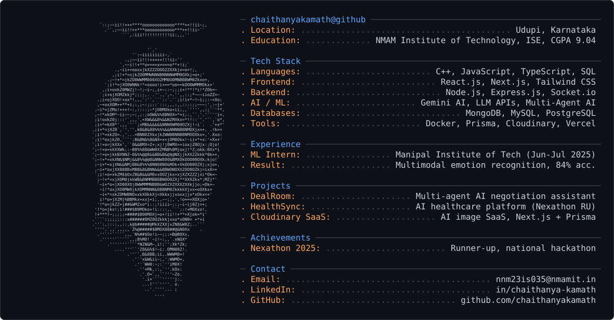

<picture>
  <source media="(prefers-color-scheme: dark)" srcset="dark_mode.svg" />
  <source media="(prefers-color-scheme: light)" srcset="light_mode.svg" />
  
</picture>

## About Me

B.E. student in Information Science at NMAM Institute of Technology, Karkala (CGPA 9.04). Full-stack developer building AI-assisted web applications end to end — authentication, data modeling, third-party integrations, and LLM-backed features — with a growing focus on multi-agent AI systems and applied machine learning.

Runner-up at Nexathon 2025 (national-level hackathon) for HealthSync, an AI-powered healthcare platform. Previously a Machine Learning Intern at Manipal Institute of Technology, working on multimodal emotion recognition.

## Experience

**Machine Learning Intern — Manipal Institute of Technology** · Jun 2025 – Jul 2025
- Developed a multimodal emotion recognition system combining text and audio features, achieving 84% overall accuracy
- Conducted research and experimentation on multimodal ML models for emotion classification, presenting findings through reports and presentations

## Tech Stack

**Languages**
`C++` `JavaScript` `TypeScript` `SQL`

**Frontend**
`React.js` `Next.js` `Tailwind CSS`

**Backend**
`Node.js` `Express.js` `REST APIs` `Socket.io`

**AI / ML**
`Gemini AI` `LLM APIs` `Speech-to-Text` `Multi-Agent AI` `PyTorch` `NumPy`

**Databases**
`MongoDB` `MySQL` `PostgreSQL`

**Tools & Cloud**
`Git` `GitHub` `Docker` `Postman` `Prisma` `Cloudinary` `MongoDB Atlas` `Neon` `Vercel`

## Featured Projects

### DealRoom — *Apr 2026*
Full-stack real-time AI negotiation assistant built on a multi-agent architecture — Strategist, Whisperer, Closer, and Simulator agents handle distinct phases of a negotiation. Integrates speech-to-text, Socket.io, and LLM APIs for context-aware responses during live conversations, with automated post-session report generation.

`React` `Node.js` `Socket.io` `LLM APIs` `Tailwind CSS`

[View Repository](https://github.com/chaithanyakamath/dealRoom)

### HealthSync — *2025* · 🏆 Runner-up, Nexathon 2025
Full-stack AI-powered healthcare platform for managing appointments, prescriptions, and patient records. Features AI prescription OCR via Gemini, OpenFDA drug-information lookup, JWT authentication, and automated email reminders.

`React` `Node.js` `MongoDB` `Gemini AI` `Cloudinary`

[View Repository](https://github.com/chaithanyakamath/healthSync)

### Cloudinary SaaS — *Aug 2026*
Full-stack SaaS platform for cloud-based image upload, management, and optimization, with AI-powered transformations — background removal, restoration, recoloring, and generative fill. Clerk authentication integrated with Prisma/PostgreSQL, deployed on Vercel.

`Next.js` `TypeScript` `Cloudinary` `Prisma` `PostgreSQL`

[View Repository](https://github.com/chaithanyakamath/cloudinarySaas) · [Live Demo](https://cloudinary-saas-mu.vercel.app)

### Deep Learning From Scratch
Core neural network architectures — MLP, sparse autoencoder, and a restricted Boltzmann-style energy-based model — implemented with plain NumPy (no TensorFlow/PyTorch) to work through forward propagation, backpropagation, and gradient descent by hand, evaluated on MNIST.

`Python` `NumPy`

[View Repository](https://github.com/chaithanyakamath/deeplearningTASK1)

## Other Projects & Practice

- **[leetcode](https://github.com/chaithanyakamath/leetcode)** — active C++ problem-solving practice
- **[placementTraining](https://github.com/chaithanyakamath/placementTraining)** — daily DSA prep logs
- **[PasswordGenerator](https://github.com/chaithanyakamath/PasswordGenerator)** — configurable password generator, React (Vite) + Tailwind
- **[WeatherAPI](https://github.com/chaithanyakamath/WeatherAPI)**, **[quoteGenerator](https://github.com/chaithanyakamath/quoteGenerator)**, **[JokeGenerator](https://github.com/chaithanyakamath/JokeGenerator)** — small API-driven front-end utilities

## Achievements & Certifications

- 🏆 **Runner-up, Nexathon 2025** — national-level hackathon, for HealthSync
- 📜 Complete Web Development Course — Udemy
- 📜 SQL Certification — HackerRank

## Extra Curricular

Multimedia Team Member & Editor, **Incridea** — photography, videography, and video editing for college events and promotional content.

## Currently Learning

Deep learning architectures (CNNs, RNNs, GANs) via hands-on PyTorch implementations, and applied multi-agent LLM system design.

## Connect

